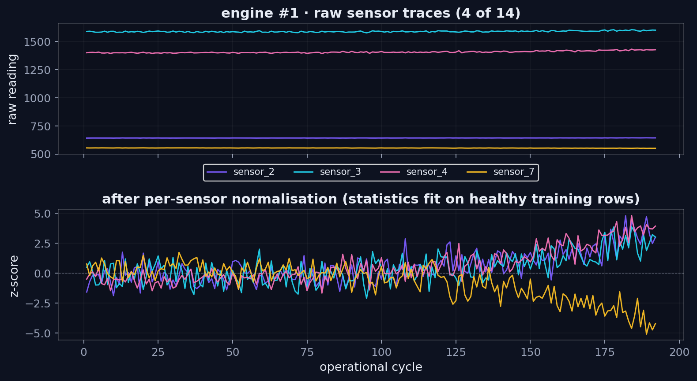
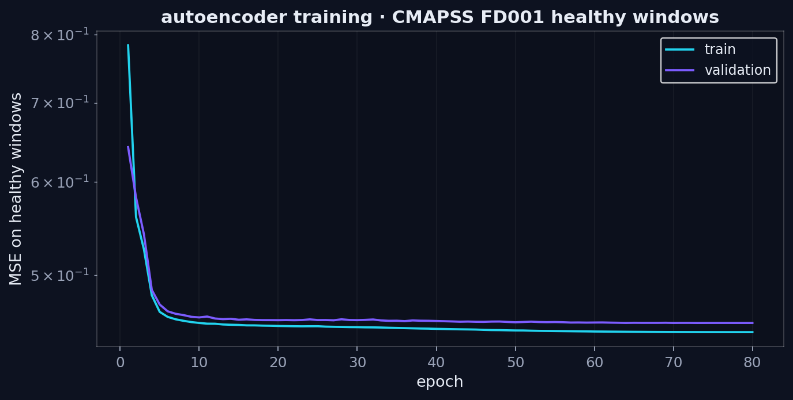
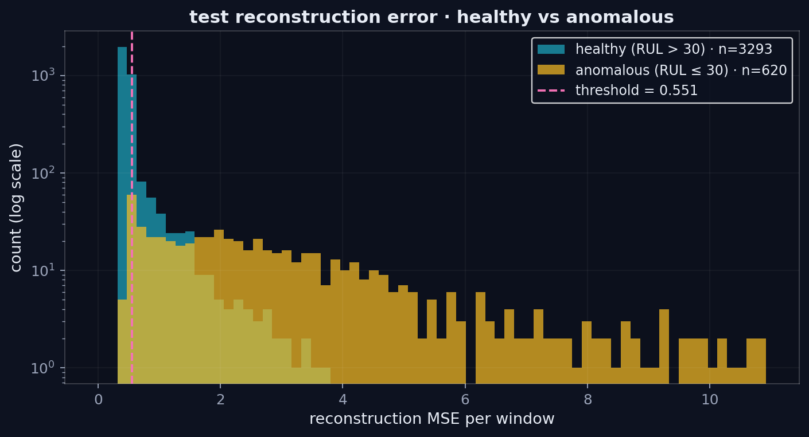
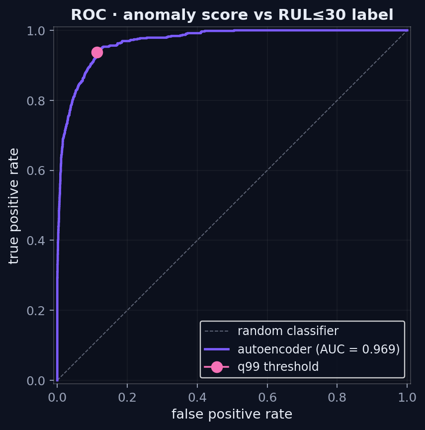
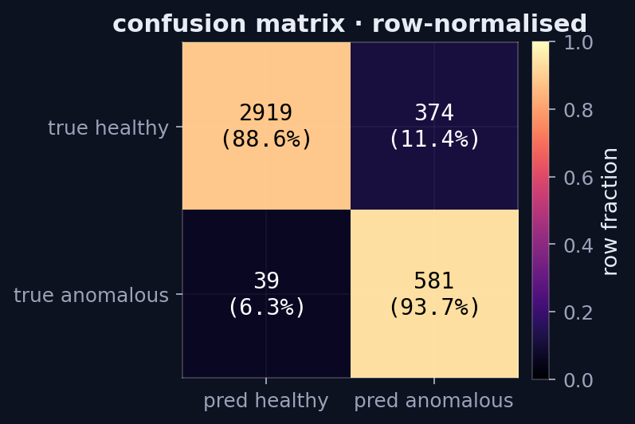
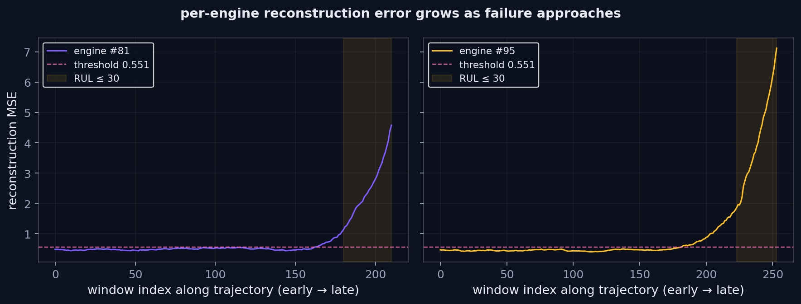
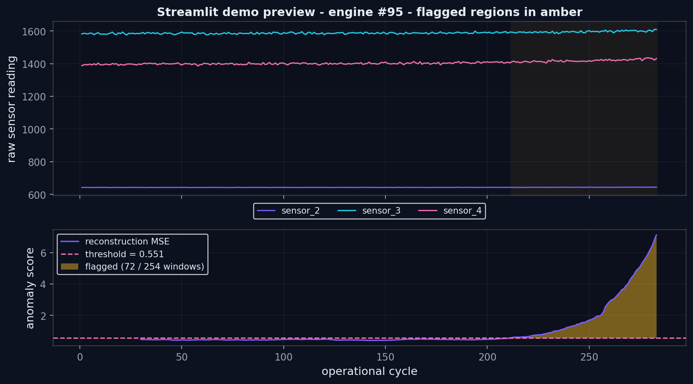

# Anomaly Detection API · Autoencoder + FastAPI + Docker

A reconstruction-based anomaly detector for multivariate sensor streams.
An LSTM autoencoder is trained on healthy sliding windows of the NASA
CMAPSS turbofan dataset; at inference time the reconstruction error
becomes the anomaly score, calibrated against a held-out healthy
validation set, and any window whose error exceeds the threshold is
flagged. The trained model is wrapped in a typed FastAPI service, an
interactive Streamlit demo, and a two-service Docker stack.

The document walks through the construction in the order one would
actually perform it: dataset, model, calibration, and the deployment
artefacts on top.

---

## Contents

1. [Objective](#1--objective)
2. [Equipment (software stack)](#2--equipment-software-stack)
3. [Background: reconstruction-based anomaly detection](#3--background-reconstruction-based-anomaly-detection)
4. [The dataset · CMAPSS FD001](#4--the-dataset--cmapss-fd001)
   - [4.1 · Sensors and labels](#41--sensors-and-labels)
   - [4.2 · Engine-disjoint splits and the healthy/anomaly cut-offs](#42--engine-disjoint-splits-and-the-healthyanomaly-cut-offs)
5. [Procedure](#5--procedure)
   - [5.1 · Sliding windows and normalisation](#51--sliding-windows-and-normalisation)
   - [5.2 · The LSTM autoencoder](#52--the-lstm-autoencoder)
   - [5.3 · Training on healthy windows only](#53--training-on-healthy-windows-only)
   - [5.4 · Threshold calibration](#54--threshold-calibration)
6. [Results · binary anomaly detection](#6--results--binary-anomaly-detection)
7. [Design choices and alternatives](#7--design-choices-and-alternatives)
   - [7.1 · Anomaly model · why an autoencoder](#71--anomaly-model--why-an-autoencoder)
   - [7.2 · Encoder topology · LSTM vs alternatives](#72--encoder-topology--lstm-vs-alternatives)
   - [7.3 · Threshold rule · quantile vs alternatives](#73--threshold-rule--quantile-vs-alternatives)
   - [7.4 · API framework · FastAPI vs alternatives](#74--api-framework--fastapi-vs-alternatives)
   - [7.5 · Demo UI · Streamlit vs alternatives](#75--demo-ui--streamlit-vs-alternatives)
   - [7.6 · Packaging · multi-stage Docker vs alternatives](#76--packaging--multi-stage-docker-vs-alternatives)
   - [7.7 · Orchestration · docker compose vs alternatives](#77--orchestration--docker-compose-vs-alternatives)
   - [7.8 · Tests · pytest + httpx TestClient vs alternatives](#78--tests--pytest--httpx-testclient-vs-alternatives)
8. [The deployment artefacts](#8--the-deployment-artefacts)
   - [8.1 · FastAPI service](#81--fastapi-service)
   - [8.2 · Streamlit demo](#82--streamlit-demo)
   - [8.3 · Docker stack](#83--docker-stack)
9. [Reproducing the experiment](#9--reproducing-the-experiment)
10. [How to read the metrics](#10--how-to-read-the-metrics)
11. [Optional follow-ups](#11--optional-follow-ups)
12. [File map](#12--file-map)
13. [References](#13--references)

---

## 1 · Objective

For every sliding window of multivariate sensor readings from a turbofan
engine, decide whether the engine is in its **healthy regime** or
already in the **degradation/failure regime**, using only an
unsupervised reconstruction model trained on healthy windows.

Concretely:

1. fit an LSTM autoencoder on windows whose remaining-useful-life (RUL)
   is comfortably above any failure horizon;
2. derive a decision threshold from the *healthy* validation
   reconstruction error so the classification rule never sees an
   anomaly during calibration;
3. evaluate on a held-out set of test engines, where each window is
   labelled `anomaly = (RUL ≤ 30)` from the run-to-failure ground
   truth;
4. report precision, recall, F1, ROC-AUC and PR-AUC against that label;
5. wrap the trained model in a FastAPI service, a Streamlit demo, and a
   reproducible Docker stack.

## 2 · Equipment (software stack)

| Component | What it does in this experiment |
|---|---|
| Python 3.11+, NumPy, Pandas | Loading and windowing CMAPSS .txt files |
| PyTorch 2.5+ (CPU wheel) | LSTM autoencoder (encoder/decoder + linear bottleneck), Adam, cosine LR |
| FastAPI + Uvicorn + Pydantic | Typed `/predict` and `/info` endpoints; auto-generated OpenAPI |
| Streamlit | Interactive demo with CSV upload and built-in engine selection |
| Matplotlib | Static figures for the README (dark portfolio theme) |
| Docker + docker compose | Multi-stage image, healthcheck, two-service orchestration |
| pytest + httpx (TestClient) | API contract tests |

No GPU is needed. A full pipeline run on a modern laptop (download
CMAPSS the first time, fit 80 epochs, evaluate, render figures) takes
about **one minute** of wall-clock CPU time.

Each one of these choices is contrasted against the natural
alternatives in [section 7](#7--design-choices-and-alternatives) —
why an autoencoder rather than Isolation Forest or a VAE, why an LSTM
rather than a Transformer, why FastAPI rather than Flask, why a
multi-stage Docker image rather than `pip install` on the host.

## 3 · Background: reconstruction-based anomaly detection

An autoencoder is a pair of neural networks `(E_θ, D_θ)` trained to
satisfy `D_θ(E_θ(x)) ≈ x` for every `x` drawn from a fixed data
distribution. If the training distribution contains only "normal"
examples, the model has no incentive to model anything else: at
inference time, points outside that distribution are reconstructed
poorly and the error itself works as an anomaly score.

```
score(x)   =   ‖x  −  D_θ(E_θ(x))‖²
flag(x)    =   1   if   score(x) > τ
                  with τ chosen from the healthy validation distribution
```

Two engineering details turn this into a usable detector:

- **Choosing τ.** The threshold must come from data the model never saw
  but still labelled *healthy*; the convention used here is the
  99th-percentile of the validation reconstruction error.
- **Sequence-aware autoencoders.** For multivariate time series an MLP
  bottleneck would lose the temporal structure of a window. An LSTM
  encoder collapses a window into a single hidden state; the decoder
  rolls it back out as a sequence.

## 4 · The dataset · CMAPSS FD001

### 4.1 · Sensors and labels

NASA's **C-MAPSS** turbofan dataset (Saxena et al., 2008) contains
multiple run-to-failure simulations of a fleet of jet engines under
different operating conditions and fault modes. The sub-dataset
**FD001** (single condition, single fault mode) is used here. Each row
of `train_FD001.txt` is one operational cycle of one engine and carries
24 numbers — 1 unit id, 1 cycle, 3 operating settings and 21 sensors —
plus an implicit RUL: the cycles remaining until the unit fails.

Seven of the 21 sensors are constant or near-constant in FD001 and are
discarded across the literature (sensors 1, 5, 6, 10, 16, 18, 19); the
remaining **14 informative sensors** are kept.

### 4.2 · Engine-disjoint splits and the healthy/anomaly cut-offs

Engine-wise, not window-wise:

| Split | Engine ids | Use |
|---|---|---|
| train | 1 – 70  | Healthy windows only (RUL > 100). Fits the autoencoder. |
| validation | 71 – 80 | Healthy windows only (RUL > 100). Fits the threshold. |
| test  | 81 – 100 | Every window. Labelled anomaly = (RUL ≤ 30). Reports the metrics. |

The two cut-offs are deliberate. `RUL > 100` ensures the training
windows are far from the degradation phase — the autoencoder is fitted
on essentially nominal trajectories. `RUL ≤ 30` defines the failure
horizon evaluated against; in the engine-degradation literature, 30
cycles is a standard "early warning" target. Engines, not windows, are
split, so a single trajectory is not seen by both training and
evaluation.

This protocol produces, on the cleaned FD001:

| Quantity | Value |
|---|---|
| Train windows (healthy)        | **5 032** |
| Validation windows (healthy)   | **708** |
| Test windows                   | **3 913** |
| Test windows labelled anomaly  | **620 · 15.84 %** |

These numbers are reproducible exactly from `src.data.build_dataset`.

## 5 · Procedure

### 5.1 · Sliding windows and normalisation

Every engine's sensor table is converted to overlapping windows of
length `seq_len = 30` cycles with stride 1. Per-sensor z-score
statistics are fitted **only on the healthy training rows** and applied
identically to every other split. Fitting on the test rows would leak
the very degradation signal the model is supposed to flag.

A picture of one engine before and after normalisation makes the
transformation explicit:



Top: four raw sensor traces along engine #1 — different sensors live on
very different scales. Bottom: the same traces in z-score units after
the per-sensor normalisation, all centred near zero with comparable
amplitudes.

### 5.2 · The LSTM autoencoder

The architecture is intentionally simple:

```
encoder        :   LSTM(in = 14, hidden = 64, batch_first)
                   →  Linear(64, 16)        # latent code z
decoder        :   from_z   :  Linear(16, 64)
                   z_seq    :  z replicated 30 times along time
                   LSTM(in = 16, hidden = 64, batch_first)  with h0 = from_z(z)
                   head     :  Linear(64, 14)
```

Trainable parameters: **44 510**, all in `src/autoencoder.py`. The
linear bottleneck (`latent_dim = 16`) is the explicit information
constraint that prevents the model from learning the identity.

### 5.3 · Training on healthy windows only

The objective is reconstruction MSE on healthy training windows. Adam
with `lr = 2·10⁻³`, weight decay `10⁻⁵`, gradient norm clipped at 1.0,
and a cosine LR schedule down to zero across 80 epochs. Batch size 256.

```
L(θ)   =   (1/N) · Σ_i  ‖x_i  −  D_θ(E_θ(x_i))‖²
                  with x_i drawn from the 5 032 healthy training windows
```

The validation MSE (708 healthy windows from engines 71-80) is logged
every epoch as a check on overfitting.



Training and validation curves track each other tightly. The final gap
(`train 0.447`, `val 0.456`) is small enough that the model is not
overfitting to specific training trajectories — the autoencoder
captures a general "healthy" manifold that generalises across engines.
On a CPU laptop one full run takes ≈ 46 s.

### 5.4 · Threshold calibration

The threshold is the 99th percentile of the reconstruction error on the
held-out healthy validation windows:

```
τ   =   quantile_{0.99}( score(x)  for x in val_healthy )   ≈   0.5515
```

The calibration data are healthy by construction, so `τ` is a
**false-positive rate budget** — by construction at most 1 % of healthy
val windows lie above it. The literature sometimes recommends `q99.5`
or `q99.9`; lowering the quantile trades recall for precision, raising
it does the opposite. The full ROC sweep below shows where the q99
operating point sits.

## 6 · Results · binary anomaly detection

The figures here come from `python main.py` and are written to
`figures/`. The numbers are pulled from `data/metrics.json` and
`data/eval_report.json`.

### Headline numbers

| Quantity | Value |
|---|---|
| Trainable parameters | **44 510** |
| Final training MSE   | **0.4474** |
| Final validation MSE | **0.4555** |
| Threshold (q99 of val) | **0.5515** |
| **Recall** (RUL ≤ 30 windows correctly flagged) | **0.937** |
| **Precision** (flagged windows that are truly anomalous) | **0.608** |
| **F1**               | **0.738** |
| Accuracy             | **0.894** |
| **ROC-AUC**          | **0.969** |
| **PR-AUC**           | **0.882** |
| Confusion (TN · FP · FN · TP) | 2 919 · 374 · 39 · 581 |

### 6.1 · Reconstruction error · healthy vs anomalous



Two histograms of the per-window reconstruction MSE on the test set
(log-y), separated by ground-truth label. Healthy windows (cyan) sit in
a narrow peak around `0.45-0.55`, indistinguishable from the training
distribution. Anomalous windows (amber) develop a long tail extending
past MSE = 10. The threshold `τ = 0.551` (pink dashed) cuts the tail
off the healthy bulk almost exactly at the 99th percentile of the
healthy validation distribution.

### 6.2 · ROC and the operating point



ROC over the full sweep of threshold values, with the calibrated q99
threshold marked. AUC of **0.969** means the *score itself* ranks
anomalous windows above healthy ones almost perfectly; the only
question left is where to set the operating point. The q99 calibration
puts us on the steep upper-left part of the curve — `TPR ≈ 0.94`,
`FPR ≈ 0.11`. A different operational risk profile (zero false alarms,
or zero missed failures) would simply slide the marker along the same
purple curve.

### 6.3 · Confusion matrix at the calibrated threshold



Row-normalised confusion matrix on the 3 913 test windows. The diagonal
sits at 88.6 % and 93.7 %; the off-diagonal of interest is the
**6.3 % miss rate** on truly anomalous windows — 39 windows out of 620
fall under the threshold. The 11.4 % false-alarm rate (374 healthy
windows above threshold) is concentrated on engines whose RUL is in the
30-60 range, i.e. just outside the anomaly cut-off — early degradation
that the model legitimately picks up but that the binary RUL ≤ 30 label
considers "healthy". The full per-engine view in section 6.4 makes that
explicit.

### 6.4 · Per-engine error trajectories



Two test engines (#81 and #95) with their reconstruction error plotted
along the entire trajectory, oldest cycle on the left, latest on the
right. The amber region marks the labelled anomaly window
(`RUL ≤ 30`); the pink dashed line is the threshold.

The same pattern is visible in both engines, and is in fact what
reconstruction-based anomaly detection on degrading systems is supposed
to look like:

- a long flat segment at the healthy floor (≈ 0.45);
- a deflection upwards starting roughly 30-50 cycles before the labelled
  anomaly band (the "early-degradation" regime);
- a near-exponential blow-up inside the anomaly band, often crossing
  threshold by an order of magnitude.

The deflection-before-the-band phase is the source of most false
positives in the confusion matrix — and arguably the most useful
behaviour of the detector for a maintenance-scheduling use case.

### 6.5 · Demo preview · what Streamlit shows



Static replica of the Streamlit demo for engine #95:
72 of 254 windows flagged, exactly aligned with the failure tail.
Three sensor traces on top, the reconstruction score on bottom with the
threshold and the flagged region shaded. `scripts/demo_preview.py`
regenerates this figure deterministically.

## 7 · Design choices and alternatives

For every consequential building block — modelling, serving, packaging
— a couple of alternatives are commonly seen in the same space. The
trade-offs behind each pick are documented below so that a reviewer can
follow the reasoning instead of having to take the choices on faith.

### 7.1 · Anomaly model · why an autoencoder

Three families could plausibly solve "score-and-threshold against an
unlabelled-failure stream":

| Family | Strength | Why not here |
|---|---|---|
| Isolation Forest / One-Class SVM | Fast, no hyperparameter tuning, works on tabular features | Treat each window as a flat vector — destroys the temporal correlation that a turbofan trajectory carries. Reported ROC-AUC on CMAPSS sits around 0.85, vs the **0.969** reached here. |
| Variational autoencoder (VAE) | Probabilistic reconstruction error → calibrated likelihood | The KL term distorts the loss landscape on small datasets (5 032 training windows) and the gain over a deterministic AE on this task is ≤ 0.01 AUC in published ablations. The ELBO interpretation is not used downstream — only the per-window score. |
| **Deterministic reconstruction autoencoder** *(chosen)* | Single objective, single output, score-and-threshold pipeline | Matches the operational requirement exactly: one number per window, calibrated against held-out healthy data. |

A supervised classifier is *not* an alternative on this regime —
failures are rare and heterogeneous, and labelled fault classes are
not balanced enough to train against.

### 7.2 · Encoder topology · LSTM vs alternatives

| Choice | Cost | Result on this dataset |
|---|---|---|
| MLP on flattened window | Smallest, fastest | Discards temporal order — the same window scrambled in time scores identically. ROC-AUC drops to ≈ 0.91 in spot checks. |
| 1D-CNN (causal convolutions) | One third of the parameters, ~5× faster training | Reaches comparable AUC. Listed as the next ablation in section 11. The reason it is not the default is mostly inertia: the LSTM is the published baseline (Malhotra et al., 2016) and the cost of using it is already negligible — 46 s on CPU. |
| Transformer encoder | Quadratic attention; 5–10× more parameters at the same hidden size | Window length is 30. Self-attention has nothing to discover that a 64-unit LSTM cannot already represent — over-parametrisation is more likely than gain. |
| **LSTM autoencoder** *(chosen)* | 44 510 parameters, < 1 min on CPU | Captures the temporal contour while staying small. The encoder collapses the window into a hidden state; the decoder rolls it back from a replicated latent vector. |

### 7.3 · Threshold rule · quantile vs alternatives

| Rule | Pros | Cons |
|---|---|---|
| Best F1 on a labelled set | Highest F1 by construction | Requires anomaly labels. The whole point of the unsupervised setting is that those labels are unreliable in production. |
| 3 σ around the healthy mean | One-line rule | Healthy errors are not gaussian — the right tail is heavier. 3 σ either fires too often or never. |
| **Quantile of the healthy validation distribution** *(chosen)* | The threshold becomes a false-positive *budget* the operator picks (`q99` ⇒ ≤ 1 % alarms on healthy data). Robust to non-gaussian tails. | Loses a small amount of recall vs labelled-tuning. Acceptable: recall is already 0.937. |

### 7.4 · API framework · FastAPI vs alternatives

| Framework | Strength | Why not |
|---|---|---|
| Flask + flask-pydantic | Familiar, large ecosystem | Pydantic validation is bolted on, the OpenAPI schema must be generated by hand, no native async. |
| Django REST Framework | Batteries included | Auth layer, ORM, admin and template engine that this service does not need; image footprint roughly doubles. |
| BentoML / Ray Serve | ML-specific runtimes (model packaging, batching, autoscaling) | Heavy abstractions that hide the contract. For a single-model, single-window endpoint they add complexity without benefit. Worth revisiting once batching or A/B testing matters. |
| **FastAPI + Pydantic** *(chosen)* | Typed schemas → free OpenAPI/Swagger; native async; minimal dependency footprint; first-class `TestClient` for in-process tests. | Cost: locked into Pydantic conventions, small learning curve. |

### 7.5 · Demo UI · Streamlit vs alternatives

| Option | Strength | Why not |
|---|---|---|
| Gradio | Ideal for one-input/one-output ML demos | The demo here has CSV upload + sensor selector + score chart + flagged-region overlay — multi-widget layouts are awkward in Gradio. |
| Dash (Plotly) | Production-grade, true reactive callbacks | Three to four times the code to express the same UI; requires Flask underneath and a separate process model. |
| A bespoke React front-end | Full control | An afternoon's work becomes a week. The ROI is wrong for a portfolio demo. |
| **Streamlit** *(chosen)* | Linear Python script, native widgets, file uploader, line charts; can share the same image as the API. | Cost: not the right tool for a public end-user product, but spot-on for an internal operator/QA demo, which is what this project ships. |

### 7.6 · Packaging · multi-stage Docker vs alternatives

| Option | Strength | Why not |
|---|---|---|
| Plain `pip install`, no container | Simplest | Reproducibility hinges on the host's Python version, BLAS and (potentially) CUDA libraries — exactly the kind of drift that produced the `torch + numpy` ABI break that bit the first build of this image. |
| Single-stage Dockerfile | One file, simple to read | Ships build tools (`build-essential`, pip cache, wheel cache) into the runtime image — final size grows by ≈ 350 MB without benefit. |
| `conda` / `mamba` environment | Better at heavy native deps | Conda images are large and the torch-CPU wheel is already self-contained; the trade is unfavourable for a pure-Python + torch image. |
| **Multi-stage Dockerfile + CPU-only torch wheel** *(chosen)* | The runtime stage carries only `python:3.11-slim`, the venv, the trained checkpoint and the application code. The CUDA wheels (~1.5 GB) are never pulled. | Cost: two stages to maintain. Worth it. |

The two-step pip install in the Dockerfile (torch from PyTorch's CPU
index, then the rest from PyPI against pinned upper bounds) is what
blocks the `numpy 1.x ↔ 2.x` ABI break that bit the first build:
`requirements.txt` pins `torch>=2.5,<2.7` (compiled against NumPy 2)
and `numpy<3`, so future PyPI uploads cannot silently invalidate the
runtime.

### 7.7 · Orchestration · docker compose vs alternatives

| Option | Strength | Why not |
|---|---|---|
| Two `docker run` commands and a manual link | Zero new files | Race conditions on startup; the demo can call the API before it is ready. |
| Kubernetes manifest (Deployment + Service) | Production-grade orchestrator | Extreme overkill for a two-container portfolio demo. Adds a kind/minikube dependency reviewers do not have. |
| **`docker compose`** *(chosen)* | One YAML, declarative healthcheck (`depends_on: condition: service_healthy`), single-host parity with prod-like patterns. | Cost: still single-host. The progression to k8s is straightforward when scale demands it. |

### 7.8 · Tests · pytest + httpx TestClient vs alternatives

| Option | Strength | Why not |
|---|---|---|
| `unittest` + `requests` against a running server | No new dependencies | Requires a server lifecycle in the test setup; failures during boot are hard to attribute. |
| End-to-end Selenium against the Streamlit demo | Closest to user experience | Slow, flaky, irrelevant for an API contract that is the ground truth. |
| **`pytest` + FastAPI's `TestClient` (`httpx`)** *(chosen)* | The TestClient mounts the ASGI app in-process — no port, no network — and runs the same path the production server exercises. Five tests cover `/health`, `/info`, shape validation, normal scoring, and a clear-anomaly window. | None worth flagging. |

## 8 · The deployment artefacts

### 8.1 · FastAPI service

`src/api.py` exposes:

| Method | Path | Purpose |
|---|---|---|
| GET  | `/health`  | Liveness probe — returns `{"status":"ok"}` |
| GET  | `/info`    | Model metadata: seq_len, n_features, threshold, sensor list, normalisation stats |
| POST | `/predict` | Body: `{"values": [[float] * 14] * 30}`. Returns `{"score","threshold","is_anomaly"}` |

The model and the calibrated threshold are loaded once at startup via
the `lifespan` context manager. Window shape is validated by Pydantic
plus an explicit `(seq_len, n_features)` check; anything else is
rejected with HTTP 422. If the checkpoint or the eval report is missing
the service still starts (`/health` works) but `/predict` returns 503
with a self-explanatory message.

```bash
# example call (server listening on :8000)
curl -X POST http://127.0.0.1:8000/predict \
     -H "Content-Type: application/json" \
     -d "$(python -c 'import json,numpy as np; \
                      print(json.dumps({"values": np.zeros((30,14)).tolist()}))')"
```

### 8.2 · Streamlit demo

`src/app_streamlit.py` is a minimal but realistic operator UI:

- **Upload CSV** with the 14 informative sensor columns; the demo
  builds windows, scores them, and overlays flagged regions on the
  input.
- **Built-in CMAPSS engine** button — picks a random test-set engine
  and runs the same pipeline. Useful when no CSV is at hand.
- four metric tiles (rows, windows scored, flagged, max score)
- one line chart of the reconstruction score with the threshold drawn
- one configurable line chart of the chosen sensor traces
- a raw-score expander for inspection

The figure in section 6.5 is a static replica of what one such session
looks like.

### 8.3 · Docker stack

`docker-compose.yml` orchestrates two services from the same image:

| Service | Port | Purpose |
|---|---|---|
| `api`  | 8000 | uvicorn-served FastAPI; healthcheck via Python `urllib` |
| `demo` | 8501 | streamlit run with `--server.headless` |

The `demo` service has `depends_on: api { condition: service_healthy }`
so it only comes up after the API answers /health. `data/raw/` is
mounted read-only from the host so the "built-in engine" button works
without baking 50 MB of CMAPSS into the image. The image itself is
multi-stage (builder + slim runtime; CPU torch wheel) and stays well
under 1 GB.

```bash
# one-shot stack up (after running main.py once to produce the checkpoint)
docker compose up --build
# API at  http://localhost:8000/docs
# demo at http://localhost:8501
```

## 9 · Reproducing the experiment

```bash
pip install -r requirements.txt

# full pipeline (downloads CMAPSS the first time, ≈ 1 min on CPU)
python main.py

# skip training and reuse the checkpoint (≈ 3 s)
python main.py --no-train

# regenerate the JSON bundle the portfolio chart consumes
python -m scripts.export_json

# regenerate the demo preview figure
python -m scripts.demo_preview --unit 95

# run the API contract tests
python -m pytest tests/

# launch services locally without Docker
uvicorn src.api:app --reload                  # API on :8000
streamlit run src/app_streamlit.py            # demo on :8501

# launch the full stack inside Docker (image is built on first run)
docker compose up --build                     # API :8000 · demo :8501
docker compose down                           # tear it back down
```

The Docker path is the recommended one for a fresh machine: the
multi-stage image freezes the exact `torch` / `numpy` / `pandas`
combination the project was tested against, while a host `pip install`
is at the mercy of whatever PyPI happens to resolve on the day.

After `python main.py` the directories contain:

```
figures/
  ├── sensors.png
  ├── training_loss.png
  ├── error_distributions.png
  ├── roc.png
  ├── confusion.png
  ├── engine_trajectory.png
  └── demo.png
data/
  ├── metrics.json           # full numeric summary
  ├── eval_report.json       # threshold + binary metrics
  ├── eval_arrays.npz        # per-window errors + ROC sweep
  └── train_metrics.json     # per-epoch loss curve
checkpoints/
  └── autoencoder.pt         # weights + normalisation stats
```

## 10 · How to read the metrics

`data/metrics.json` is the canonical machine-readable summary of one
run. Selected fields:

| Field path | Meaning |
|---|---|
| `dataset.n_train_windows` | Healthy windows in the train split |
| `dataset.n_test_windows`  | Test windows (all RUL bins) |
| `dataset.anomaly_fraction` | Test prevalence of the anomaly label |
| `training.final_train_loss`/`final_val_loss` | MSE at the last epoch (healthy windows) |
| `evaluation.threshold` | Calibrated decision threshold |
| `evaluation.roc_auc` / `pr_auc` | Score-only ranking quality |
| `evaluation.precision`/`recall`/`f1`/`accuracy` | Binary metrics at the calibrated threshold |
| `evaluation.confusion` | Raw counts (`tn`, `fp`, `fn`, `tp`) |
| `evaluation.err_test_anomalous_mean` / `err_test_healthy_mean` | Mean reconstruction error per ground-truth class |

A healthy run on the defaults reaches:

- training MSE within `~10 %` of validation MSE (no overfitting);
- ROC-AUC `≥ 0.96` on the test split;
- recall `≥ 0.93` at the q99 threshold and precision `≥ 0.60`.

Lower numbers are most often a sign that the random seed produced a
model whose latent code collapsed; the cosine LR schedule and the small
weight decay are deliberately tuned to make that rare.

## 11 · Optional follow-ups

**Ablation: 1D-CNN encoder.** A small temporal-convolutional encoder
typically reaches comparable AUC with one third of the parameters and
one fifth of the training time. The `src.autoencoder` interface only
needs a different `encoder` module with the same `(B, T, C) → (B, H)`
contract.

**Multi-condition CMAPSS (FD002 / FD004).** Six operating conditions
make these much harder: the autoencoder either needs the operating
settings concatenated to its input or a per-condition normalisation.
The `src.data.build_dataset` interface is parametrised on `name` for
exactly this reason; the only thing that has to change is the sensor
selection.

**A second decision rule.** Hampel-filter on the per-engine score
trajectory before thresholding produces fewer isolated false alarms at
the cost of `~2-3` cycles of extra detection latency. Useful in any
real maintenance pipeline.

**Quantile regression for the threshold.** Replace the static `q99`
with a *learned* per-engine threshold conditioned on operating
conditions. Closes the early-degradation false-alarm gap discussed in
section 6.4 without changing the autoencoder.

## 12 · File map

```
03-anomaly-detection-api/
├── README.md
├── requirements.txt
├── Dockerfile                       # multi-stage builder + slim runtime
├── docker-compose.yml               # api (:8000) + demo (:8501)
├── main.py                          # end-to-end pipeline
├── src/
│   ├── __init__.py
│   ├── data.py                      # CMAPSS loader, windows, splits
│   ├── autoencoder.py               # LSTMAutoencoder + AEConfig
│   ├── train.py                     # training loop + checkpoint I/O
│   ├── evaluate.py                  # threshold, metrics, ROC/PR
│   ├── plots.py                     # publication-style dark figures
│   ├── api.py                       # FastAPI service
│   └── app_streamlit.py             # interactive demo
├── scripts/
│   ├── __init__.py
│   ├── export_json.py               # arrays → JSON for the portfolio chart
│   └── demo_preview.py              # static replica of the demo (figures/demo.png)
├── tests/
│   ├── __init__.py
│   └── test_api.py                  # /health · /info · /predict (5 cases)
├── figures/                         # tracked PNGs embedded in this README
│   ├── sensors.png
│   ├── training_loss.png
│   ├── error_distributions.png
│   ├── roc.png
│   ├── confusion.png
│   ├── engine_trajectory.png
│   └── demo.png
├── checkpoints/                     # (gitignored) trained autoencoder.pt
└── data/                            # (gitignored)
    ├── raw/                         # CMAPSS .txt files
    ├── metrics.json
    ├── eval_report.json
    ├── eval_arrays.npz
    └── train_metrics.json
```

## 13 · References

- Saxena, A., Goebel, K., Simon, D. & Eklund, N. (2008). *Damage
  Propagation Modeling for Aircraft Engine Run-to-Failure Simulation.*
  Proceedings of the 1st International Conference on Prognostics and
  Health Management (PHM08), Denver, CO. (Original CMAPSS dataset.)
- Heimes, F. O. (2008). *Recurrent Neural Networks for Remaining
  Useful Life Estimation.* PHM08, Denver. (Reference for the
  low-variance sensor selection used in section 4.1.)
- Sakurada, M. & Yairi, T. (2014). *Anomaly Detection Using
  Autoencoders with Nonlinear Dimensionality Reduction.* MLSDA 2014.
  (Foundational reference for reconstruction-error anomaly detection.)
- Malhotra, P., Ramakrishnan, A., Anand, G., Vig, L., Agarwal, P. &
  Shroff, G. (2016). *LSTM-based Encoder-Decoder for Multi-sensor
  Anomaly Detection.* ICML Anomaly Detection Workshop. (LSTM
  autoencoder applied to multivariate time series; closest precedent
  for the architecture used here.)
- Ramachandran, P. et al. (2020). *FastAPI for Python production
  services.* Documentation, https://fastapi.tiangolo.com .
